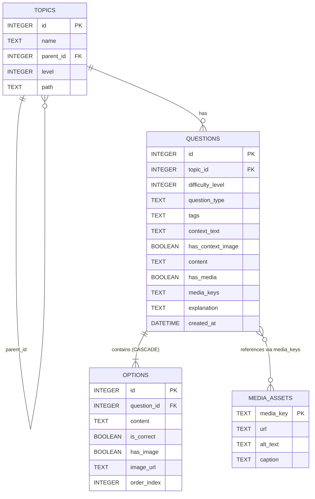

# TechQuiz Pro — Nền Tảng Trắc Nghiệm & Luyện Thi Kỹ Thuật

[](https://nodejs.org/)
[](https://www.typescriptlang.org/)
[](https://expressjs.com/)
[](https://github.com/WiseLibs/better-sqlite3)
[](https://react.dev/)
[](https://tailwindcss.com/)
[](https://katex.org/)

TechQuiz Pro là giải pháp máy chủ REST API cục bộ và giao diện người dùng hiện đại, hiệu năng cao phục vụ thi cử, luyện tập câu hỏi trắc nghiệm kỹ thuật chuyên sâu (Điện - Điện Tử, Vi Mạch, Kiến Trúc Máy Tính, Tự Động Hóa PLC). Hệ thống tích hợp trình kết xuất công thức toán học **LaTeX (KaTeX)**, phân tích văn bản **Markdown (Marked.js)** và công cụ bóc tách thẻ ảnh kỹ thuật tự động **Media Regex Parser**.

---

## 📑 Mục Lục
- [1. Kiến Trúc Hệ Thống & Công Nghệ](#1-kiến-trúc-hệ-thống--công-nghệ)
- [2. Cấu Trúc Cơ Sở Dữ Liệu SQLite](#2-cấu-trúc-cơ-sở-dữ-liệu-sqlite)
- [3. Dịch Vụ Phân Tích Thẻ Media (Media Regex Parser)](#3-dịch-vụ-phân-tích-thẻ-media-media-regex-parser)
- [4. Danh Sách REST API Endpoints](#4-danh-sách-rest-api-endpoints)
- [5. Các Giao Diện Người Dùng Chính](#5-các-giao-diện-người-dùng-chính)
- [6. Hướng Dẫn Cài Đặt & Khởi Chạy](#6-hướng-dẫn-cài-đặt--khởi-chạy)
- [7. Cấu Trúc Thư Mục Dự Án](#7-cấu-trúc-thư-mục-dự-án)

---

## 1. Kiến Trúc Hệ Thống & Công Nghệ

### Backend
- **Ngôn ngữ & Runtime**: Node.js, TypeScript.
- **Web Framework**: Express.js (v5).
- **Cơ sở dữ liệu**: SQLite qua `better-sqlite3` lưu trữ tại `./data/app.db`.
- **Chế độ hoạt động**: Kích hoạt `PRAGMA journal_mode = WAL` (Write-Ahead Logging) và `PRAGMA foreign_keys = ON` bảo đảm tốc độ truy vấn cao và toàn vẹn dữ liệu.
- **Mô hình kiến trúc đa tầng (Layered Architecture)**:
  $$\text{Routes} \longrightarrow \text{Controllers} \longrightarrow \text{Services} \longrightarrow \text{Repositories} \longrightarrow \text{Database (better-sqlite3)}$$

### Frontend
- **Thư viện UI**: React 19 với TypeScript và Vite bundler.
- **Kiểu dáng (Styling)**: Tailwind CSS v4, thiết kế tối ưu độ tương phản cao (High Contrast Slate theme) cho sơ đồ mạch và công thức.
- **Trình dựng toán học & văn bản**: 
  - **KaTeX**: Hiển thị công thức toán học inline `$f_0 = \frac{1}{2\pi\sqrt{LC}}$` và block `$$Z = \sqrt{R^2 + (\omega L - \frac{1}{\omega C})^2}$$`.
  - **Marked.js**: Biên dịch cú pháp Markdown (bảng, danh sách, chữ đậm/nghiêng).
- **Trải nghiệm Lightbox Zoom**: Xem và phóng to/thu nhỏ ảnh sơ đồ kỹ thuật với hiệu ứng làm mờ nền (backdrop blur) và thao tác kéo rê (pan/drag).

---

## 2. Cấu Trúc Cơ Sở Dữ Liệu SQLite

Toàn bộ cơ sở dữ liệu được khởi tạo tự động trong tệp tin `./data/app.db`:



### Chi tiết các bảng:
1. **`topics`** (Phân cấp 3 cấp độ):
   - `id`: Khóa chính tự tăng.
   - `name`: Tên chủ đề.
   - `parent_id`: Khóa ngoại trỏ về `topics(id)` hoặc `NULL`.
   - `level`: Cấp độ (`1`: Môn học, `2`: Chương, `3`: Chủ đề con).
   - `path`: Đường dẫn phân cấp trực quan hóa (Materialized path, ví dụ: `dien-dien-tu/linh-kien-ban-dan/tu-dien`).
2. **`media_assets`**:
   - `media_key`: Khóa chính chuỗi (ví dụ: `fig_circuit_001`).
   - `url`: Đường dẫn tài nguyên tĩnh (`/media/filename.svg`).
   - `alt_text`: Văn bản thay thế hỗ trợ truy cập.
   - `caption`: Chú thích sơ đồ hiển thị bên dưới ảnh.
3. **`questions`**:
   - `id`: Khóa chính.
   - `topic_id`: Khóa ngoại tham chiếu `topics(id)`.
   - `difficulty_level`: Mức độ (`1`: Dễ, `2`: Trung bình, `3`: Nâng cao).
   - `question_type`: Mặc định `SINGLE_CHOICE`.
   - `tags`: Mảng JSON chuỗi (ví dụ: `["RLC", "AC Circuit"]`).
   - `context_text`: Phần thông tin bối cảnh/sơ đồ chung (Markdown + LaTeX + thẻ media).
   - `has_context_image`: Tự động gán `1` nếu `context_text` chứa thẻ media.
   - `content`: Nội dung câu hỏi chính (Markdown + LaTeX + thẻ media).
   - `has_media`: Tự động gán `1` nếu `content` chứa thẻ media.
   - `media_keys`: Mảng JSON lưu trữ danh sách các `media_key` đã trích xuất.
   - `explanation`: Lời giải chi tiết (Markdown + LaTeX).
   - `created_at`: Thời gian tạo.
4. **`options`**:
   - `id`: Khóa chính.
   - `question_id`: Khóa ngoại liên kết `questions(id)` kèm `ON DELETE CASCADE`.
   - `content`: Nội dung phương án (hỗ trợ công thức KaTeX).
   - `is_correct`: `1` nếu là đáp án đúng, `0` nếu là đáp án sai.
   - `has_image`: Đánh dấu phương án có kèm ảnh hay không.
   - `image_url`: Đường dẫn ảnh phương án (nếu có).
   - `order_index`: Thứ tự hiển thị (1: A, 2: B, 3: C, 4: D).

---

## 3. Dịch Vụ Phân Tích Thẻ Media (Media Regex Parser)

Lớp `QuestionService` quản lý toàn bộ logic nghiệp vụ xử lý thẻ hình ảnh kỹ thuật:

- **Mẫu Regex chuẩn hóa**:
  ```regexp
  /<!--\s*media:([\w-]+)\s*-->/g
  ```

- **Quy trình khi Tạo mới hoặc Cập nhật Câu hỏi (`POST /api/questions`)**:
  1. Quét đồng thời `context_text` và `content` bằng mẫu Regex.
  2. Trích xuất toàn bộ các `media_key` xuất hiện (ví dụ: `["fig_circuit_001", "fig_opamp_002"]`).
  3. Tự động bật `has_context_image = 1` nếu `context_text` chứa thẻ media.
  4. Tự động bật `has_media = 1` nếu `content` chứa thẻ media.
  5. Lưu trữ danh sách khóa dưới dạng chuỗi JSON vào cột `media_keys`.
  6. Thực thi toàn bộ thao tác thêm câu hỏi và các phương án liên quan trong một **khối giao dịch nguyên tử (Atomic Transaction)** qua `db.transaction(...)`.

- **Quy trình khi Truy xuất Câu hỏi (`GET /api/questions`)**:
  1. Đọc thông tin câu hỏi và các phương án lựa chọn liên kết.
  2. Parse mảng JSON `media_keys`.
  3. Truy vấn bảng `media_assets` lấy thông tin chi tiết cho toàn bộ các khóa có trong `media_keys`.
  4. Đóng gói từ điển `media_map` trả về trực tiếp trong payload:
     ```json
     {
       "media_map": {
         "fig_circuit_001": {
           "media_key": "fig_circuit_001",
           "url": "/media/fig_circuit_001.svg",
           "alt_text": "Sơ đồ mạch điện RLC nối tiếp",
           "caption": "Mạch RLC nối tiếp mắc vào nguồn xoay chiều u(t)"
         }
       }
     }
     ```

---

## 4. Danh Sách REST API Endpoints

Tất cả phản hồi từ API đều tuân thủ định dạng JSON chuẩn hóa:
- **Thành công**: `{ "success": true, "data": ... }`
- **Thất bại**: `{ "success": false, "message": "Thông báo lỗi" }`

| Phương thức | Đường dẫn API | Mô tả chức năng |
| :--- | :--- | :--- |
| `GET` | `/api/topics` | Lấy danh sách chủ đề (hỗ trợ `?tree=true` để lấy cây phân cấp 3 tầng hoặc `?level=1\|2\|3`) |
| `POST` | `/api/topics` | Tạo mới một chủ đề với `parent_id` và `level` |
| `GET` | `/api/questions` | Lấy danh sách câu hỏi lọc theo `?topic_id=:id&difficulty=:level` kèm `media_map` và `options` |
| `GET` | `/api/questions/:id` | Lấy chi tiết một câu hỏi theo ID |
| `POST` | `/api/questions` | Tạo câu hỏi mới (kích hoạt Regex Parser và Atomic Transaction) |
| `DELETE`| `/api/questions/:id` | Xóa câu hỏi (tự động xóa cascade các options) |
| `POST` | `/api/media/upload` | Tải tệp tin ảnh lên `./data/uploads/`, trả về `media_key` và URL |
| `GET` | `/api/media` | Lấy danh sách tất cả tài sản media trong hệ thống |
| `GET` | `/media/:filename` | Phục vụ tệp tin tĩnh (Static file serving) cho ảnh và sơ đồ kỹ thuật |
| `GET` | `/api/db/schema` | Lấy cấu trúc DDL SQL, danh sách bảng, chỉ mục và dung lượng database |
| `GET` | `/api/db/table/:name`| Truy vấn dữ liệu thực tế của bảng (`topics`, `questions`, `options`, `media_assets`) |
| `POST` | `/api/db/seed` | Nạp dữ liệu kỹ thuật mẫu (RLC, Op-Amp, Transistor BJT, PLC Ladder Logic, Cache AMAT) |

---

## 5. Các Giao Diện Người Dùng Chính

### 1. Giao Diện Luyện Thi & Làm Bài (`QuizPage.tsx`)
- **Thanh công cụ trên cùng (Top Bar)**:
  - Bộ chọn chủ đề phân tầng 3 cấp: Môn học (Cấp 1) $\to$ Chương (Cấp 2) $\to$ Chủ đề con (Cấp 3).
  - Bộ lọc mức độ khó (Dễ / Trung bình / Khó).
  - Đồng hồ đếm ngược (Countdown Timer) tích hợp tính năng tạm dừng / tiếp tục và cảnh báo màu đỏ khi dưới 5 phút.
  - Nút ngôi sao đánh dấu câu hỏi cần xem lại (Bookmark toggle).
  - Nút chuyển đổi giữa **Chế độ Luyện Tập** (hiển thị giải thích ngay khi nộp) và **Chế độ Thi Thử** (tính tổng điểm bài thi).
- **Cột chính bên trái (8 Cột)**:
  - Khung bối cảnh & sơ đồ kỹ thuật (`context_text`).
  - Nội dung câu hỏi (`content`).
  - Bộ chọn đáp án trắc nghiệm với phím tắt nhanh (`A`, `B`, `C`, `D` hoặc `1`, `2`, `3`, `4`):
    - Trạng thái chọn: Viền xanh dương sáng (`border-cyan-500 bg-cyan-950/30`).
    - Trạng thái đúng: Viền xanh lá cây (`border-emerald-500 bg-emerald-950/30`).
    - Trạng thái sai: Viền đỏ hồng (`border-rose-500 bg-rose-950/30`).
  - Hộp lời giải chi tiết (Slide-down Explanation) với hiệu ứng chuyển cảnh mượt mà, phân tích các bước biến đổi công thức trọng tâm.
- **Cột điều hướng ma trận bên phải (4 Cột)**:
  - Lưới ma trận các câu hỏi (1, 2, 3... 40).
  - Mã màu trực quan: Đang chọn (Xanh lam nhạt), Đã làm (Xanh dương), Đúng (Xanh lá), Sai (Đỏ), Có dấu sao (Chấm vàng).
  - Bộ lọc ma trận: Xem tất cả, Câu chưa làm, Câu đã đánh dấu sao.
  - Bảng thống kê tiến độ, tỉ lệ phần trăm chính xác (Accuracy %) và số câu đã hoàn thành.

### 2. Studio Soạn Thảo Câu Hỏi Kỹ Thuật (`AdminEditor.tsx`)
- **Bố cục chia đôi màn hình (Split-Screen Live Preview)**:
  - **Bên trái**: Trình soạn thảo văn bản giao diện tối hỗ trợ Markdown + LaTeX + thẻ `<!-- media:KEY -->`.
  - **Bên phải**: Màn hình xem trước thời gian thực (Real-time Live Preview) qua hàm `renderMathAndMarkdown()`.
- **Thanh chèn nhanh công thức toán học**:
  - Chèn nhanh các biểu thức phổ biến: `$V_{in}$`, `$V_{out}$`, `$Z = \sqrt{R^2 + X_L^2}$`, `$f_0 = \frac{1}{2\pi\sqrt{LC}}$`, `\frac{a}{b}`, `\beta`, `\omega`, `\Omega`, `\mu\text{F}`, `\text{k}\Omega`, ma trận, tích phân.
- **Quản lý & Tải lên Media trực tiếp**:
  - Tải ảnh sơ đồ trực tiếp vào `./data/uploads/`, tự động tạo khóa và chèn cú pháp `<!-- media:KEY -->` vào vị trí con trỏ.
- **Thanh nạp mẫu bài tập (Templates)**:
  - Nạp nhanh mẫu bài tập Mạch RLC nối tiếp, Khuếch đại thuật toán Op-Amp chỉ với một cú nhấp chuột.

### 3. Trình Kiểm Tra Cơ Sở Dữ Liệu SQLite (`DbInspector.tsx`)
- Thống kê thời gian thực dung lượng tệp `./data/app.db`, chế độ ghi nhật ký `WAL`, số lượng bản ghi mỗi bảng.
- Xem chi tiết từng bảng dữ liệu với bộ lọc tìm kiếm theo từ khóa và hiển thị chuỗi JSON mở rộng.
- Kiểm tra toàn bộ câu lệnh SQL DDL `CREATE TABLE` và `CREATE INDEX`.
- Nút bấm nạp lại dữ liệu kỹ thuật mẫu tiện lợi.

---

## 6. Hướng Dẫn Cài Đặt & Khởi Chạy

### Yêu Cầu Môi Trường
- **Node.js**: Phiên bản 18, 20 hoặc 22 trở lên.
- **npm**: Đi kèm theo Node.js.

### Bước 1: Cài đặt Dependencies
```bash
npm install
```

> **Lưu ý**: Dự án sử dụng `better-sqlite3`. Nếu trên hệ thống Linux/WSL có nhiều phiên bản Python, hãy bảo đảm node-gyp sử dụng Python hệ thống hỗ trợ gyp:
> ```bash
> npm_config_python=/usr/bin/python3 npm install
> ```

### Bước 2: Nạp Dữ Liệu Kỹ Thuật Mẫu (Seeding)
Chạy lệnh sau để khởi tạo các bảng và nạp các câu hỏi mẫu về Điện - Điện Tử (RLC, Op-Amp, BJT, PLC Ladder Logic, Kiến trúc máy tính) kèm sơ đồ SVG:
```bash
npm run seed
```

### Bước 3: Khởi Chạy Ứng Dụng (Cả Backend & Frontend)
Hệ thống được cấu hình chạy đồng thời Backend Express (Port 3001) và Frontend Vite (Port 5173):
```bash
npm run dev
```

* **Frontend UI**: [http://localhost:5173](http://localhost:5173)
* **Backend REST API**: [http://localhost:3001/api](http://localhost:3001/api)
* **Kho Media tĩnh**: [http://localhost:3001/media/fig_circuit_001.svg](http://localhost:3001/media/fig_circuit_001.svg)

### Bước 4: Xây dựng Bản Phát Hành (Production Build)
```bash
npm run build
```

---

## 7. Cấu Trúc Thư Mục Dự Án

```
tech-quiz-app/
├── package.json                 # Cấu hình dự án, scripts và dependencies
├── tsconfig.json                # Cấu hình TypeScript compiler
├── vite.config.ts               # Cấu hình Vite, Tailwind CSS plugin và API Proxy
├── index.html                   # HTML entry point nạp Google Fonts & KaTeX CSS
├── data/
│   ├── app.db                   # Tệp tin SQLite Database (WAL mode)
│   └── uploads/                 # Thư mục lưu trữ hình ảnh và sơ đồ SVG kỹ thuật
└── src/
    ├── server/                  # TẦNG BACKEND (Express + better-sqlite3)
    │   ├── db/
    │   │   ├── database.ts      # Khởi tạo kết nối SQLite, cấu hình WAL & foreign keys
    │   │   ├── schema.ts        # DDL SQL định nghĩa bảng topics, questions, options, media_assets
    │   │   └── seed.ts          # Script tạo sơ đồ SVG và nạp dữ liệu câu hỏi mẫu
    │   ├── types/
    │   │   └── index.ts         # TypeScript Interfaces & DTOs cho backend
    │   ├── repositories/
    │   │   ├── topic.repository.ts
    │   │   ├── media.repository.ts
    │   │   └── question.repository.ts
    │   ├── services/
    │   │   ├── question.service.ts # Core Media Regex Parser & Atomic Transactions
    │   │   ├── topic.service.ts    # Xử lý cây phân cấp 3 cấp độ
    │   │   └── media.service.ts    # Xử lý upload và quản lý media asset
    │   ├── controllers/
    │   │   ├── question.controller.ts
    │   │   ├── topic.controller.ts
    │   │   ├── media.controller.ts
    │   │   └── db.controller.ts
    │   ├── routes/
    │   │   ├── question.routes.ts
    │   │   ├── topic.routes.ts
    │   │   ├── media.routes.ts
    │   │   ├── db.routes.ts
    │   │   └── index.ts
    │   ├── middleware/
    │   │   ├── errorHandler.ts  # Middleware định dạng lỗi JSON chuẩn hóa
    │   │   └── upload.ts        # Multer diskStorage lưu trữ ảnh vào ./data/uploads/
    │   ├── app.ts               # Cấu hình Express app, static serving và CORS
    │   └── index.ts             # Khởi động server HTTP tại port 3001
    └── client/                  # TẦNG FRONTEND (React 19 + Tailwind v4 + KaTeX)
        ├── main.tsx             # Entry point React DOM
        ├── App.tsx              # Component gốc, router điều hướng và global lightbox handler
        ├── index.css            # Thiết kế token CSS, KaTeX enhancements & media-container
        ├── types/
        │   └── index.ts         # TypeScript types giao diện người dùng
        ├── utils/
        │   ├── mathMarkdown.ts  # renderMathAndMarkdown(): Tokenize KaTeX + Marked + Media tag
        │   └── api.ts           # Fetch API wrappers
        ├── components/
        │   ├── Header.tsx       # Thanh điều hướng trên cùng kèm trạng thái SQLite
        │   ├── LightboxModal.tsx# Modal phóng to sơ đồ với zoom in/out/pan/reset
        │   ├── MathMarkdownRenderer.tsx # Render nội dung công thức toán & Markdown
        │   └── TopicSelector.tsx# Dropdown chọn chủ đề phân cấp 3 cấp
        └── pages/
            ├── QuizPage.tsx     # Giao diện làm bài thi trắc nghiệm & ma trận câu hỏi
            ├── AdminEditor.tsx  # Studio soạn thảo chia đôi màn hình (Live preview)
            └── DbInspector.tsx  # Trình kiểm tra schema và dữ liệu SQLite
```

---

## 8. Giấy Phép (License)
Dự án được phát hành theo giấy phép **ISC License**.
